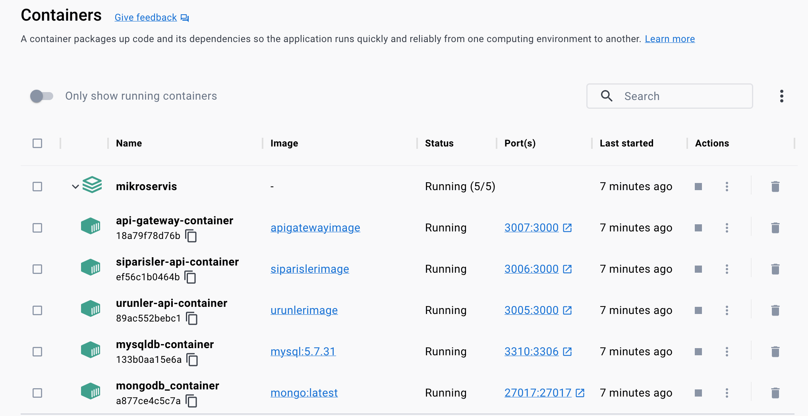
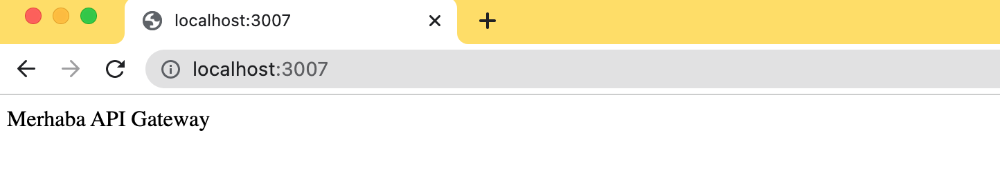
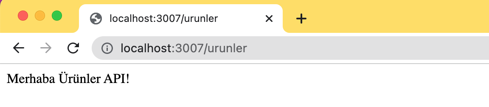
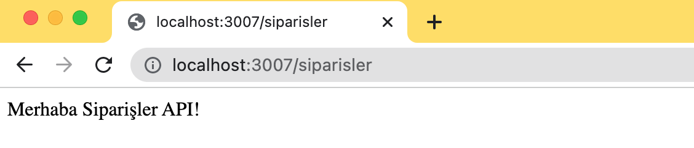

# Mikroservis Örneği
Bu uygulama Yazılım Mühendisliği dersinde mikroservis konusunu daha iyi kavrayabilmek için hazırlanmış basit bir mikroservis örneğidir. Uygulamada 2 mikroservis (REST API olarak düşünebilirsiniz), 1 API Gateway bulunmaktadır.
* **Siparişler Mikroservisi:** Ekrana "Merhaba Siparişler API!" ifadesini yazdırır. 3006 portunda çalışır
* **Ürünler Mikroservisi:** Ekrana "Merhaba Ürünler API!" ifadesini yazdırır. 3005 portunda çalışır.
* **API Gateway:** Siparişler ve Ürünlere mikroservisleri için bir gateway/proxy görevi görür. Ana adrese gidildiğinde Ekrana "Merhaba API Gateway" ifadesini yazdırır. Sorumluluğu gelen istekleri ilgili mikroservislere yönlendirmektir. 3007 portunda çalışır.

Her bir mikroservis ve API Gateway bir docker kapsayıcısı içinde çalışmaktadır. Mikroservislerin farklı veritabanlarıyla çalışabileceğini göstermek için MySQL ve MongoDB veritabanlarının kapsayıcıları da oluşturulmuştur ve mikroservislerle bağlantıları sağlanmıştır.

## Kullanılan Teknolojiler ve Araçlar
* **Progamlama Dili:** Javascript
* **Kullanılan Kütüphaneleer:** express, http-proxy-middleware
* **Veritabanı:** MongoDB, MySQL
* **Veri Modelleme:** Mongoose
* **IDE:** Visual Studio Code
* **Dağıtım:** Docker (docker-compose) 

## Uygulamanın Çalıştırılması
Uygulamanın çalıştırılması için Docker'ın yüklü olması gerekmektedir.
1. Visual Studio Code ile klasör açılarak.
2. İlk aşamada kapsayıcıların oluşturulması gerekmektedir. Terminal ekranına aşağıdaki komut yazılır.
    ### `docker-compose build`
3. Tüm kapsayıcıların ayağa kaldırılması ve çalışır hale gelmeleri için aşağıdaki komut çalıştırılır.
    ### `docker-compose up`
4. API Gateway [http://localhost:3007](http://localhost:3007) adresinde çalışmaktadır.
5. Siparişler API [http://localhost:3006/siparisler](http://localhost:3006/siparisler) adresinde çalışmaktadır.
6. Ürünler API [http://localhost:3005/ürünler](http://localhost:3005/urunler) adresinde çalışmaktadır.
7. API Gateway aracılığıyla Ürünler API'sine erişmek için [http://localhost:3007/ürünler](http://localhost:3007/urunler) adresine gidilir.
8. API Gateway aracılığıyla Siparişler API'sine erişmek için [http://localhost:3007/siparisler](http://localhost:3007/siparisler) adresine gidilir.

# Ekran Görüntüleri
**Docker Kapsayıcıları**

**API Gateway**

**Ürünler API**

**Siparişler API**

